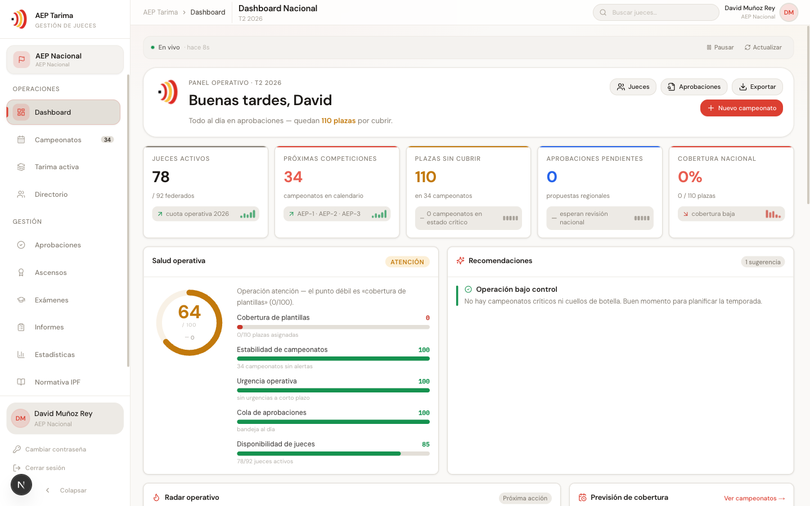
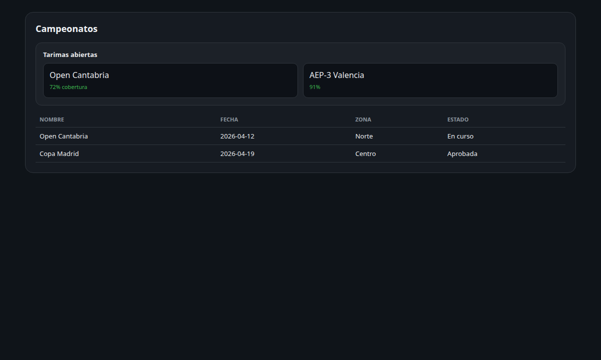
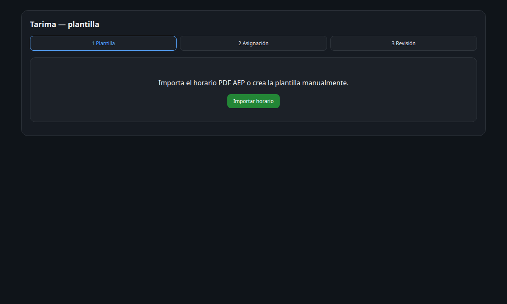
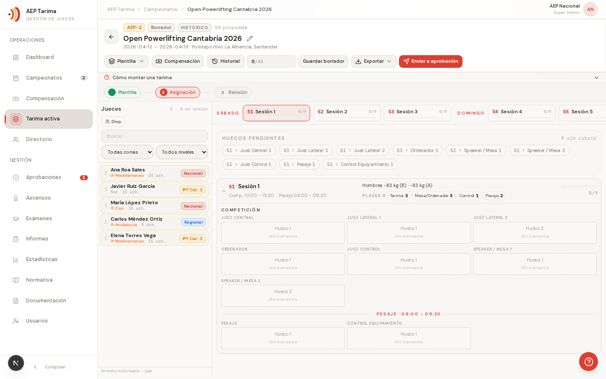
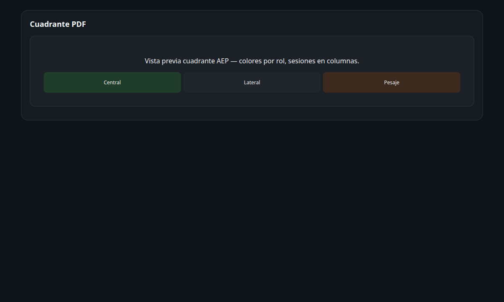
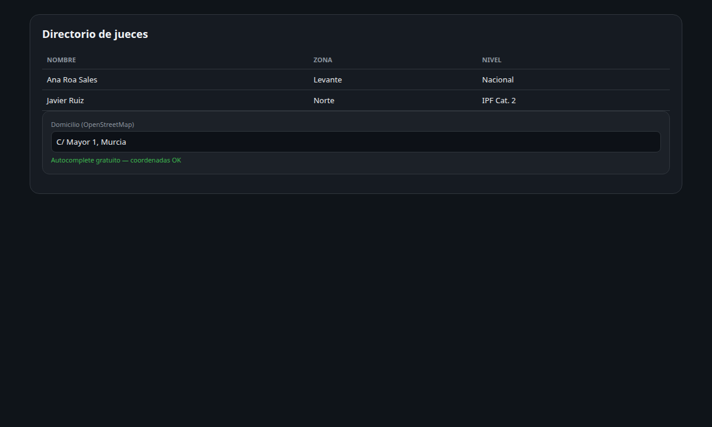
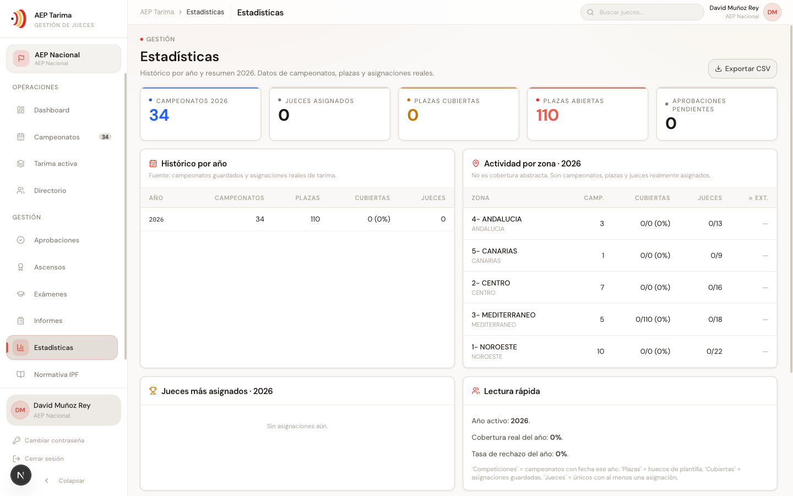
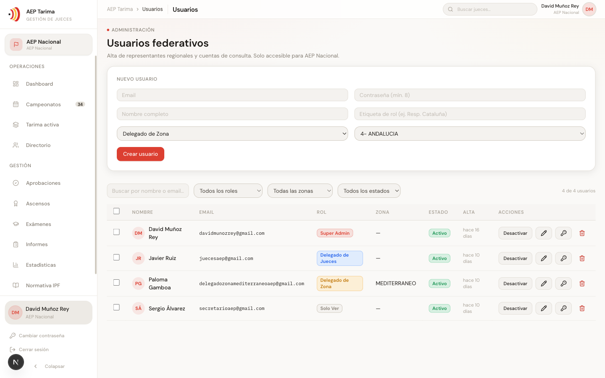
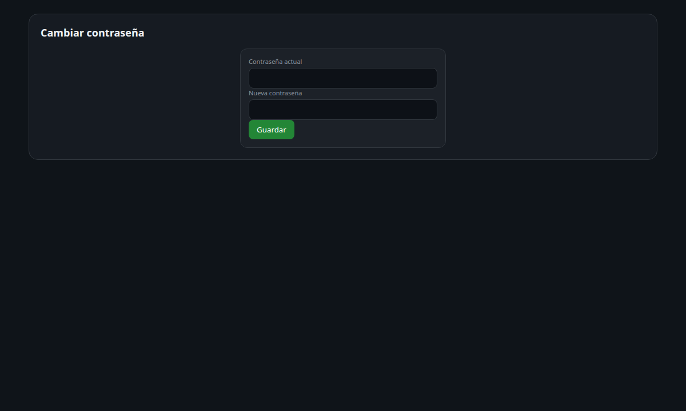

# Guía de uso — AEP Tarima

Guía visual de la plataforma de gestión de jueces de la Asociación Española de Powerlifting.
Cada sección muestra una captura real de la app y los pasos para usarla.

> Capturas tomadas en entorno de desarrollo con datos reales. La app no está ligada a una temporada fija: las fechas de campeonatos y el analytics determinan el año en pantalla.

---

## 1. Entrar

1. Abre `/sign-in`.
2. Introduce tu **email** y **contraseña**.
3. Si no recuerdas la contraseña, usa "¿Olvidaste tu contraseña?" o pide a un administrador que te la resetee (ver §9).

Sin registro público: las cuentas las crea AEP Nacional.

---

## 2. Dashboard

Pantalla de inicio. Resume el estado operativo de la temporada en curso.

- **KPIs** (arriba): jueces activos, próximas competiciones, plazas sin cubrir, aprobaciones pendientes, cobertura nacional.
- **Salud operativa**: índice 0–100 ponderado (cobertura de plantillas, estabilidad, urgencia, aprobaciones, disponibilidad).
- **Recomendaciones**: avisos priorizados por severidad (crítico/alerta/sugerencia).
- **En vivo**: el panel se refresca solo; el botón "Pausar" lo detiene.

Atajos arriba a la derecha: **Jueces**, **Aprobaciones**, **Exportar**, **+ Nuevo campeonato**.

---

## 3. Campeonatos

`Campeonatos` en el menú lateral. Lista todos los campeonatos de la temporada.

- **Tarimas abiertas** (arriba): tarjetas de los campeonatos en curso, priorizados por cobertura pendiente. Botón "Montar tarima".
- **Todos los campeonatos** (abajo): tabla con búsqueda y filtros por tipo (AEP-1/2/3), zona y estado. En móvil se muestra como tarjetas.
- **Importar calendario AEP**: sube el calendario anual (PDF/CSV) → preview → selecciona qué campeonatos crear.
- **+ Nuevo campeonato**: alta manual.

Cada fila tiene icono de **Cuadrante PDF** (export directo) y "Montar tarima".

---

## 4. Tarima — montar una plantilla

Al abrir un campeonato sin plantilla, la app guía el flujo en 3 pasos: **Plantilla → Asignación → Revisión**.

1. **Importar horario (PDF)**: sube el horario oficial AEP → detecta sesiones, categorías y horarios → preview → guarda la plantilla.
2. O **Crear plantilla manual**: define sesiones y plazas a mano.

La cabecera agrupa las acciones en dos menús:
- **Plantilla ▾**: Importar horario, Importar cuadrante, Editar plantilla, Vaciar jueces, Borrar plantilla.
- **Exportar ▾**: Cuadrante PDF, Cuadrante Excel, Acta (texto), Compartir WhatsApp.

---

## 5. Tarima — asignar jueces

Con la plantilla creada, la pestaña **Asignación** muestra dos paneles: jueces disponibles (izquierda) y sesiones con sus plazas (derecha).

Tres formas de asignar:
1. **Arrastrar** un juez de la izquierda a una plaza.
2. **Clic** en una plaza y luego en un juez.
3. **Importar cuadrante (PDF)** desde "Plantilla ▾": detecta los jueces del cuadrante oficial, los cruza con el directorio y propone las asignaciones. Funciona con los 4 formatos AEP (rejilla, "SESIÓN N", cabeceras escalonadas; los escaneados avisan).

Filtros del panel izquierdo: zona, nivel, búsqueda, y "solo confirmados" (disponibilidad). El sistema avisa de huecos, solapes y cruces de zona.

Cuando esté listo: **Guardar borrador** o **Enviar a aprobación**.

---

## 6. Exportar el cuadrante

Desde **Exportar ▾** en la tarima (o el icono PDF en la lista de campeonatos) generas el cuadrante en formato oficial AEP:

- **Cuadrante PDF**: abre en pestaña nueva con el formato AEP (colores por rol, leyenda) y abre el diálogo de impresión para guardar como PDF. Las posiciones sin asignar quedan en blanco.
- **Cuadrante Excel**: `.xlsx` con una hoja por día (roles=filas, sesiones=columnas).
- **WhatsApp**: comparte un resumen de cobertura + enlace al cuadrante.

---

## 6b. Compensación de gastos (responsable financiero)

Rol **`responsable_financiero_jueces`**: gestiona la compensación económica de jueces asignados en tarima. No edita tarima ni censo.

1. Abre un campeonato con jueces asignados.
2. Pulsa **Compensación** en la cabecera de tarima (o navega a `/competitions/[id]/compensation`).
3. Configura organizador (club o AEP), nombre/email del club y si es voluntario.
4. **Recalcular** genera claims desde el cuadrante (sesiones, pesaje, km, alojamiento).
5. Ajusta overrides por juez si hace falta (km manual, alojamiento, responsable de competición).
6. **Exportar recibo** → introduce el IBAN en el modal (no se guarda en la app) → descarga PDF.

El recibo sigue las plantillas reales AEP/club. El IBAN solo existe en la petición de export y en el PDF generado.

---

## 7. Jueces — directorio y ficha

`Directorio` en el menú. Lista todos los jueces con búsqueda y filtros (zona, nivel, estado).

- Clic en un juez abre su **ficha**: datos, **domicilio** (para cálculo de km en compensación), historial real por campeonato (sesión, rol, hueco, flags de compartido/intercambio), sanciones, exámenes, informes y ascensos.
- **Importar Excel maestro**: alta/actualización masiva del registro (solo AEP Nacional).
- **+ Nuevo juez**: alta individual.

---

## 8. Estadísticas

`Estadísticas` en el menú. Histórico anual y KPIs.

- KPIs por año (campeonatos, plazas, cubiertas, jueces).
- Columna de cruce de zonas.
- **Exportar CSV** para análisis externo.

---

## 9. Usuarios y contraseñas

`Usuarios` (solo AEP Nacional: `super_admin` / `delegado_jueces`).

Por cada usuario, la columna **Acciones** ofrece: activar/desactivar, editar (rol/zona), **resetear contraseña** (icono llave) y eliminar.

### Cambiar tu propia contraseña

Cualquier usuario puede cambiarla desde el botón **"Cambiar contraseña"** del menú lateral (abajo). Pide la contraseña actual y la nueva (mín. 8 caracteres).

### Resetear la de otro usuario (admin)

Desde Usuarios → icono llave de la fila → escribe la nueva contraseña. No necesitas conocer la actual. Solo un `super_admin` puede resetear a otro `super_admin`.

---

## 10. Aprobaciones, ascensos, exámenes, informes

- **Aprobaciones**: las propuestas de tarima enviadas esperan revisión nacional aquí.
- **Ascensos**: solicitud y revisión de cambios de categoría de juez.
- **Exámenes**: nuevo juez, ascenso a categoría IPF, recertificación.
- **Informes**: por juez o por competición; el delegado de zona ve solo los de su zona, nacional ve todo.

---

## 11. Roles y permisos

| Rol | Alcance |
|---|---|
| `super_admin` | Control total |
| `delegado_jueces` | Autoridad nacional sobre jueces, exámenes, informes, ascensos |
| `delegado_zona` | Campeonatos, tarimas y jueces de **su zona** |
| `responsable_financiero_jueces` | Compensación de gastos y export de recibos PDF (lectura de tarimas/censo) |
| `solo_ver` | Solo lectura |

La UI oculta las acciones fuera de tu alcance, pero el servidor es la fuente de verdad (un delegado de zona no puede tocar datos de otra zona aunque manipule la petición).

---

## 12. Errores frecuentes

- **El PDF de cuadrante no detecta a nadie**: probablemente es un PDF escaneado (imagen). Vuelve a exportarlo desde el documento original con texto seleccionable, o asigna a mano.
- **Campeonato pasado**: queda en solo lectura; la API mutadora devuelve `423`.
- **Excel grande al importar jueces**: divide el archivo o elimina hojas no usadas (límite 8 MB).
- **No veo "Usuarios"**: solo es visible para AEP Nacional (`super_admin` / `delegado_jueces`).
