# Guía de uso — AEP Tarima

Guía visual de la plataforma de gestión de jueces de la Asociación Española de Powerlifting.

**URL producción:** [https://aep-tarima.vercel.app](https://aep-tarima.vercel.app)

> Capturas en `docs/images/`. La app no está ligada a una temporada fija: el año en pantalla lo determinan las fechas de campeonatos y el analytics.

---

## 1. Entrar

1. Abre `/sign-in`.
2. Introduce tu **email** y **contraseña**.
3. Si no recuerdas la contraseña, usa "¿Olvidaste tu contraseña?" o pide a un administrador que te la resetee (ver §9).

Sin registro público: las cuentas las crea AEP Nacional.

---

## 2. Dashboard

Pantalla de inicio. Resume el estado operativo de la temporada en curso.

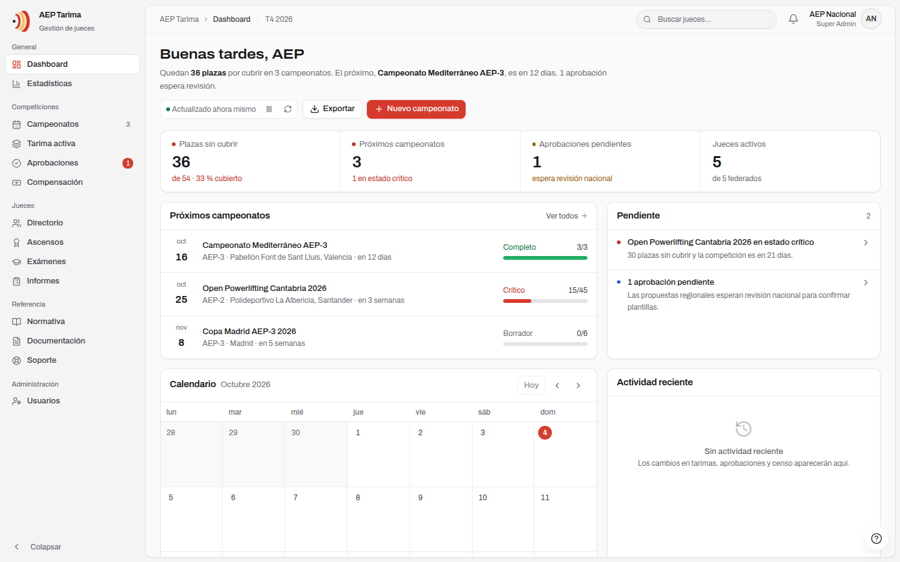

- **Encabezado**: una frase con lo esencial (plazas por cubrir, el próximo campeonato y las aprobaciones en espera), el indicador de actualización y los botones **Exportar** y **+ Nuevo campeonato**.
- **Cifras**: plazas sin cubrir, próximos campeonatos, aprobaciones pendientes y jueces activos. Cada una lleva a su pantalla. Los campeonatos ya celebrados no cuentan.
- **Próximos campeonatos**: fecha, sede, cuánto falta y la cobertura real de cada tarima (plazas asignadas sobre plazas de la plantilla).
- **Pendiente**: lo que pide hacer algo (tarimas críticas o cercanas con huecos, aprobaciones, ascensos, sanciones activas).
- **Calendario** y **Actividad reciente**.
- **Actualización**: el panel se refresca solo cuando otro usuario cambia algo. El botón de pausa la detiene de verdad hasta que lo reanudas; el de flecha circular actualiza en el acto.

Todas las cifras salen de la misma cuenta, así que el mismo campeonato dice lo mismo en todos los bloques.

---

## 2b. Barra lateral y documentación

El menú se organiza en cinco grupos, y el rótulo pequeño encima del título de cada página dice en cuál estás:

| Grupo | Secciones |
|---|---|
| **General** | Dashboard, Estadísticas |
| **Competiciones** | Campeonatos, Tarima activa, Aprobaciones · Compensación (responsable financiero / super_admin) |
| **Jueces** | Directorio, Ascensos, Exámenes, Informes |
| **Referencia** | Normativa, Documentación (`/docs`), Soporte (`/tickets`) |
| **Administración** | Usuarios (solo AEP Nacional) |

- **Tarima activa** abre directamente el campeonato vigente más próximo.
- El **usuario y «Cambiar contraseña»** están en la **esquina superior derecha** (topbar), no en el pie del menú.
- **Colapsar** guarda la preferencia en el navegador; plegado, los contadores se ven como un punto.
- **En el móvil** el menú se abre con el botón **☰** de arriba a la izquierda (incluye el buscador de jueces) y se cierra solo al elegir una sección.

---

## 3. Campeonatos

`Campeonatos` en el menú lateral. Lista todos los campeonatos de la temporada.

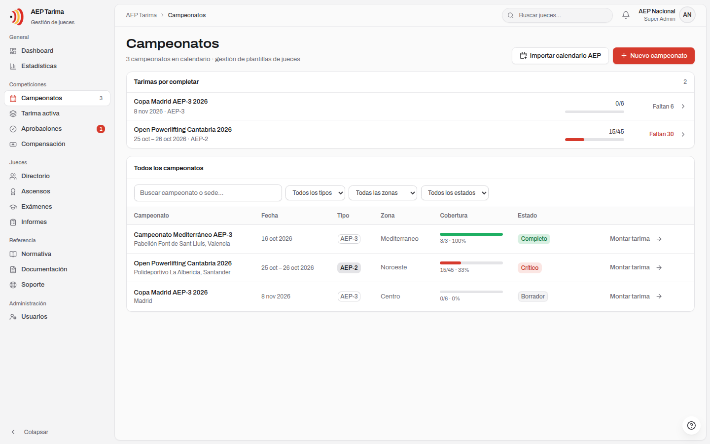

- **Tarimas abiertas** (arriba): tarjetas de los campeonatos en curso, priorizados por cobertura pendiente. Botón "Montar tarima".
- **Todos los campeonatos** (abajo): tabla con búsqueda y filtros por tipo (AEP-1/2/3), zona y estado. En móvil se muestra como tarjetas.
- **Importar calendario AEP**: sube el calendario anual (PDF/CSV) → preview → selecciona qué campeonatos crear.
- **+ Nuevo campeonato**: alta manual.

Cada fila tiene icono de **Cuadrante PDF** (export directo) y "Montar tarima".

---

## 4. Tarima — montar una plantilla

Al abrir un campeonato sin plantilla, la app guía el flujo en 3 pasos: **Plantilla → Asignación → Revisión**. Un campeonato recién creado arranca en **Plantilla**, y cada paso solo aparece como hecho cuando lo está de verdad.

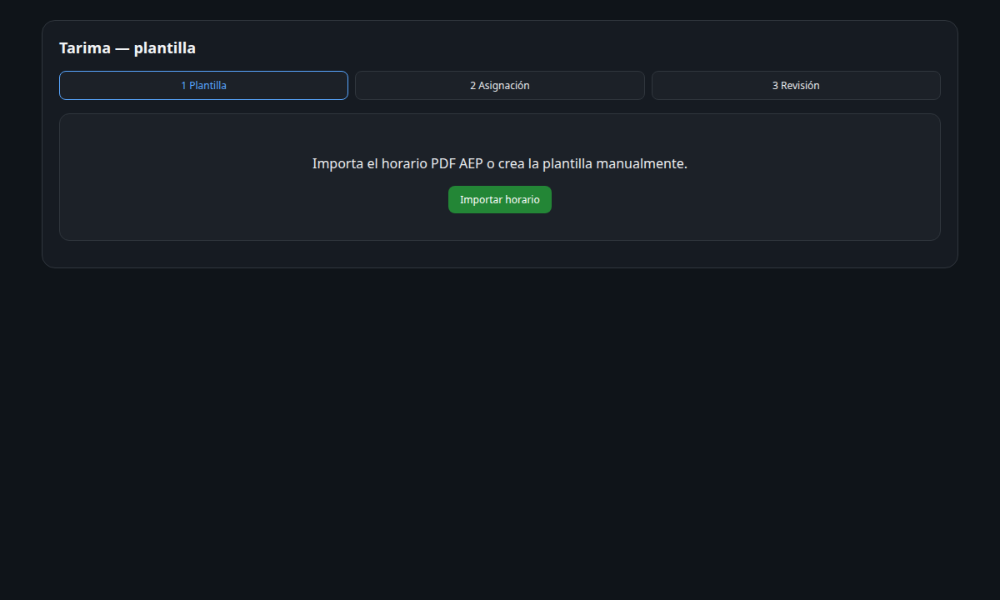

1. **Importar horario (PDF)**: sube el horario oficial AEP → detecta sesiones, categorías y horarios → preview → guarda la plantilla.
2. O **Crear plantilla manual**: define sesiones y plazas a mano.

La cabecera agrupa las acciones en dos menús:
- **Plantilla ▾**: Importar horario, Importar cuadrante, Editar plantilla, Vaciar jueces, Borrar plantilla.
- **Exportar ▾**: Cuadrante PDF, Cuadrante Excel, Acta (texto), Compartir WhatsApp.

---

## 5. Tarima — asignar jueces

Con la plantilla creada, la pestaña **Asignación** muestra dos paneles: jueces disponibles (izquierda) y sesiones con sus plazas (derecha).

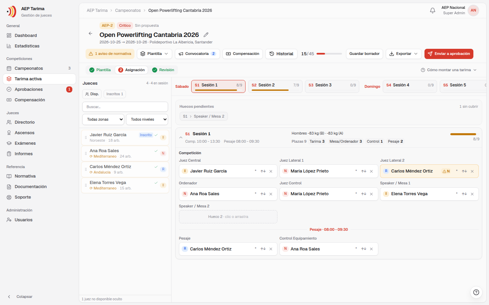

Tres formas de asignar:
1. **Arrastrar** un juez de la izquierda a una plaza.
2. **Clic** en una plaza y luego en un juez.
3. **Importar cuadrante (PDF)** desde "Plantilla ▾": detecta los jueces del cuadrante oficial, los cruza con el directorio y propone las asignaciones. Funciona con los 4 formatos AEP (rejilla, "SESIÓN N", cabeceras escalonadas; los escaneados avisan).

Filtros del panel izquierdo: zona, nivel, búsqueda, y «solo confirmados» (disponibilidad). Si los filtros dejan la lista vacía, **Quitar filtros** la restablece. Los jueces **de baja** o marcados como **no disponibles** en su ficha nunca aparecen en este panel; el pie del panel indica cuántos quedan ocultos por ese motivo. Los **badges de nivel** en tarima son compactos (**R**, **N**, **I**, **II**); en el directorio se muestra el nombre completo. El sistema avisa de huecos, solapes y cruces de zona.

**Selección rápida** (al pulsar un hueco): la lista de la izquierda se ordena por **idoneidad** y muestra **solo los jueces disponibles**. Va **después** del paso de disponibilidad: si ya hay disponibilidad confirmada para el campeonato, oculta a los no confirmados. El **nivel recomendado** para la plaza es solo un **aviso**: no bloquea la asignación (los bloqueos duros, como repetir el mismo puesto, sí se ocultan).

Cuando esté listo: **Guardar borrador** o **Enviar a aprobación**. El envío está desactivado (y lo explica al pasar el ratón) mientras no haya plantilla o ningún juez asignado. Mientras la propuesta espera revisión, la tarima queda congelada.

### Tarima aprobada e imprevistos

Si la tarima ya fue **aprobada** por el Comité, queda bloqueada para evitar cambios accidentales. Si surge un imprevisto (baja de última hora, sustitución urgente, etc.):

1. Abre el campeonato en tarima.
2. Pulsa **Registrar imprevisto** en el aviso amarillo de la cabecera.
3. Modifica las asignaciones necesarias.
4. **Enviar a aprobación** de nuevo para que el Comité valide los cambios.

---

## 6. Exportar el cuadrante

Desde **Exportar ▾** en la tarima (o el icono PDF en la lista de campeonatos) generas el cuadrante en formato oficial AEP:

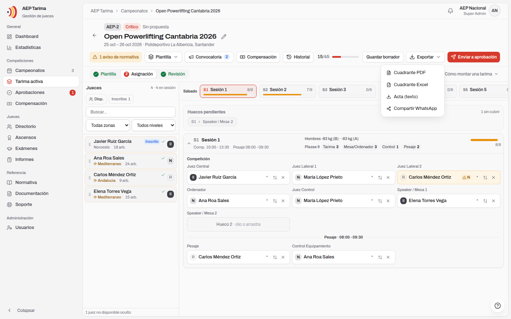

- **Cuadrante PDF**: abre en pestaña nueva con el formato AEP (colores por rol, leyenda) y abre el diálogo de impresión para guardar como PDF. Las posiciones sin asignar quedan en blanco.
- **Cuadrante Excel**: `.xlsx` con una hoja por día (roles=filas, sesiones=columnas).
- **WhatsApp**: comparte un resumen de cobertura + enlace al cuadrante.

---

## 6b. Panel central de compensación

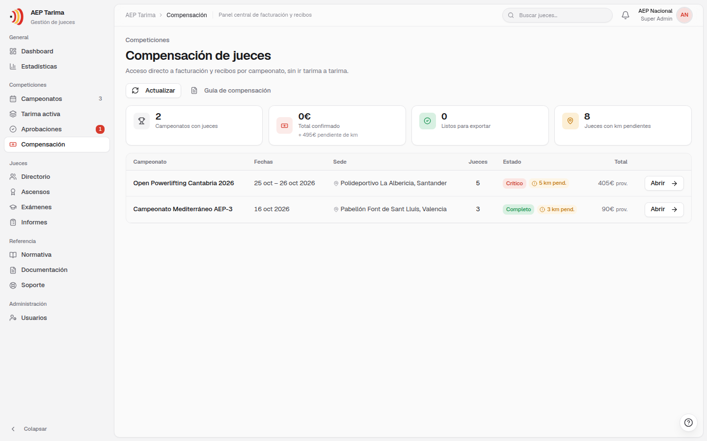

Rol **`responsable_financiero_jueces`**: accede desde **Compensación** en el menú lateral.

- Lista todos los campeonatos con jueces asignados en tarima.
- Muestra km pendientes, estado y total confirmado.
- Botón **Abrir** → compensación del campeonato concreto.
- Enlace a la guía en `/docs`.

## 6c. Compensación por campeonato

Rol **`responsable_financiero_jueces`**: gestiona la compensación económica de jueces asignados en tarima. No edita tarima ni censo.

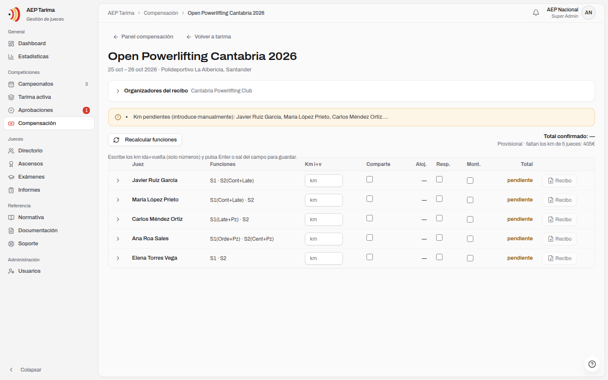

1. Entra en **Compensación** en la barra lateral (panel central) o abre un campeonato concreto.
2. Pulsa **Compensación** en la cabecera de tarima (o `/competitions/[id]/compensation`).
3. Elige el **organizador del recibo** (selector con 3 opciones):
   - **Club(es) organizador(es)**: uno o varios clubes y sus e-mails de devolución (listado oficial AEP).
   - **Asociación Española de Powerlifting**: membrete y correos nacionales.
   - **Personalizable**: introduces los nombres y correos a mano (cuando organiza una entidad que no está en el listado). La cabecera y los correos del pie del recibo se ajustan al organizador elegido.
4. Introduce los **km ida+vuelta manualmente** por juez en la tabla.
5. Marca **Comparte** si el juez viaja en vehículo compartido (solo exime kilometraje; el alojamiento sigue según los km).
6. Marca **Mont.** si el juez **monta el sistema informático** (Liftingcast / OpenLifter / Goodlift) e introduce el importe. Esto es distinto de ocupar la posición ordenador en tarima (eso sale del cuadrante como cualquier otra función).
7. Revisa el **desglose por sesión Sx** con la posición real en tarima (Central, Pesaje, Lateral…) expandiendo cada fila.
8. **Exportar recibo** → IBAN en el modal (no se guarda) → **PDF con logo AEP** (cabecera y correos según el organizador; el desglose detallado se ve en pantalla antes de exportar).

Los totales de viaje y alojamiento no se confirman hasta que todos los km estén completos.

- Una vez guardado el organizador, su tarjeta se pliega y muestra el nombre en la cabecera; ábrela para cambiarlo.
- Una liquidación marcada como **pagada** queda en solo lectura (distintivo «pagada»): recalcular, calcular distancias o cambiar la tarima no la tocan, y el juez pagado no se puede quitar de su hueco.

---

## 7. Jueces — directorio y ficha

`Directorio` en el menú. Lista todos los jueces con búsqueda y filtros (zona, nivel, estado).

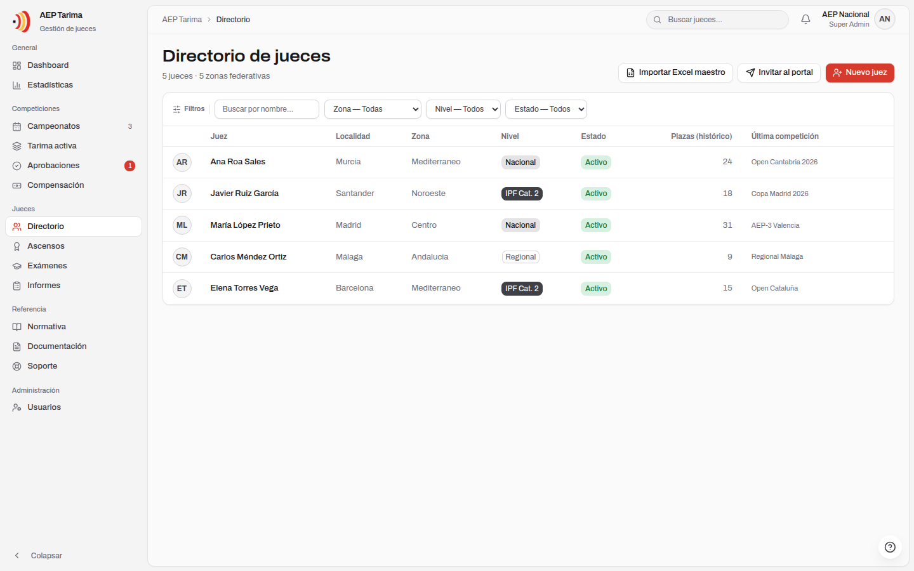

- La ficha incluye **domicilio con autocomplete OpenStreetMap**: escribe al menos 3 caracteres y elige una sugerencia de la lista (búsqueda vía servidor). Si no hay sugerencia, puedes guardar y el servidor intentará geocodificar con Nominatim.
- **Eliminar ubicación**: botón junto al campo domicilio borra dirección y coordenadas en Supabase al instante (útil si el juez ya no debe tener km de compensación calculados desde ese domicilio).
- **Arbitrajes por año natural**: la ficha del juez incluye un **selector de año** más la opción **«Histórico»** (agregado de todos los años). Por defecto muestra el año natural más reciente con actividad (censo vigente). En el **directorio** hay un **filtro de censo por año** para ver quién arbitró en cada año natural, separado del histórico.
- La cabecera de la ficha muestra nivel, estado y disponibilidad. **No disponible** significa que el juez no aparecerá al montar tarimas.
- Historial real por campeonato (sesión, rol, hueco, flags compartido/intercambio), sanciones, exámenes, informes y ascensos.
- **Importar Excel maestro**: alta/actualización masiva del registro (solo AEP Nacional). La opción **«reemplazar censo»** reimporta el Excel completo de forma segura: solo borra los jueces **ausentes del Excel y no asignados** a ninguna tarima; **no toca campeonatos ni cuadrantes** y conserva (avisando) a los jueces ya asignados.
- **+ Nuevo juez**: alta individual.

---

## 5b. Convocatorias

En vez de llamar uno a uno, lanza una **convocatoria** y deja que los jueces se apunten desde su portal.

1. En la tarima del campeonato (con la plantilla hecha), pulsa **Convocar**.
2. Marca las sesiones, la fecha límite para apuntarse (por defecto, una semana antes) y, si quieres, un mensaje (horario de llegada, uniforme…). **Lanzar convocatoria**.
3. Los jueces de la zona con cuenta en el portal la ven y se apuntan a cada sesión a la que pueden ir.
4. En la tarima, el botón **Convocatoria** lleva la cuenta de inscritos. En el panel de jueces, los que se apuntaron a la sesión que estás montando salen **arriba** con la etiqueta *Inscrito*, y el filtro **Inscritos** deja solo a ellos.
5. Desde el mismo botón puedes **cerrar** la convocatoria antes de tiempo, **reabrirla** o cambiar la fecha límite, y **cancelarla**.

Apuntarse no es estar designado: tú montas la tarima y, cuando se aprueba, el juez la ve en «Mis sesiones». Un juez con sanción activa o con la ficha inactiva no puede apuntarse.

**Otras zonas**

- Al lanzarla (o después, desde el mismo botón) puedes **abrirla también a otras zonas**. Si eres de la gestión nacional, sus jueces la ven en el acto; si eres delegado de zona, el delegado de la otra zona tiene que **aceptarlo** antes.
- Marca **«Si faltan inscritos, pedir ayuda a las demás zonas»** y cuántos días antes del cierre: si para entonces alguna sesión tiene menos inscritos que plazas, se pide a todas las demás zonas (cada delegado decide si se suma).
- Las peticiones de otras zonas a la tuya te llegan a la campana y aparecen en **Pendiente**, en el panel de inicio, con **Aceptar** y **Rechazar**.
- Un juez de otra zona que asignes desde la convocatoria cuenta como asignación de fuera de zona, como siempre.

**Después de aprobar la tarima**

Cada juez designado recibe un aviso y, en su portal, confirma que va o dice que no puede (con el motivo). Si alguno no puede, te llega a la campana y la tarima lo muestra arriba («… no puede ir. Registra un imprevisto para sustituirle») y en su hueco («No va»).

**La campana**

Arriba a la derecha (en el panel y en el portal). Avisa de convocatorias nuevas, peticiones de otras zonas y sus respuestas, el cierre de una convocatoria al día siguiente, las designaciones y los jueces que no pueden ir. Al abrirla, los avisos quedan leídos.

---

## 7b. Portal del juez

Cada juez del censo puede tener su propia cuenta para ver sus designaciones y apuntarse a convocatorias. Solo entra a su portal: no ve el directorio, ni otras fichas, ni las tarimas.

**Dar acceso**

- Desde el **directorio**: **Invitar al portal** invita a los jueces de la lista que estás viendo (aplica antes los filtros de zona o nivel). Te dice cuántos ya tienen acceso y cuántos no tienen e-mail en la ficha.
- Desde la **ficha del juez**: el bloque *Portal del juez* muestra si tiene acceso y permite **Invitar**, **Reenviar enlace** o **Retirar acceso** (efecto inmediato).
- El propio juez puede pedirlo en la pantalla de acceso, pestaña **Soy juez** (enlace directo: `/sign-in?juez=1`): si su e-mail es el de su ficha, le llega el enlace.

Un delegado de zona solo invita a jueces de su zona. Si el e-mail de la ficha ya es de una cuenta de gestión (un delegado que también es juez), no se invita: avisa al Comité.

**Lo que ve el juez** (pensado para el móvil)

- **Inicio**: sus próximas designaciones y, si la tiene, el aviso de sanción activa.
- **Mis sesiones**: cada campeonato en el que está designado (con **Confirmo** / **No puedo ir**), sesión a sesión, con el día, los horarios de pesaje y competición y su función; y su historial. Solo aparecen tarimas **aprobadas**: un borrador todavía puede cambiar.
- **Mi ficha**: sus datos del censo. Si algo no es correcto, te lo pedirá a ti.
- **Convocatorias**: los campeonatos a los que se puede apuntar. Entra en uno y pulsa **Apuntarme** en cada sesión a la que pueda ir; se guarda al momento y puede retirarse mientras la convocatoria siga abierta. Si ese fin de semana ya está designado en otro campeonato, se le avisa.

---

## 8. Estadísticas

`Estadísticas` en el menú. Histórico anual y KPIs.

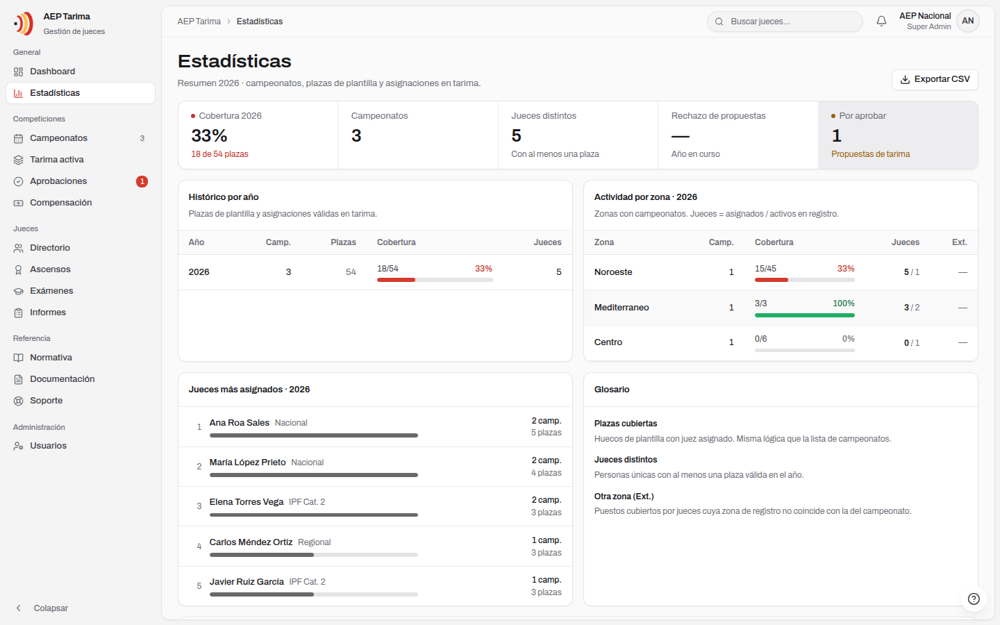

- KPIs por año (campeonatos, plazas, cubiertas, jueces).
- Columna de cruce de zonas.
- **Exportar CSV** para análisis externo.

---

## 9. Usuarios y contraseñas

`Usuarios` (solo AEP Nacional: `super_admin` / `delegado_jueces`).

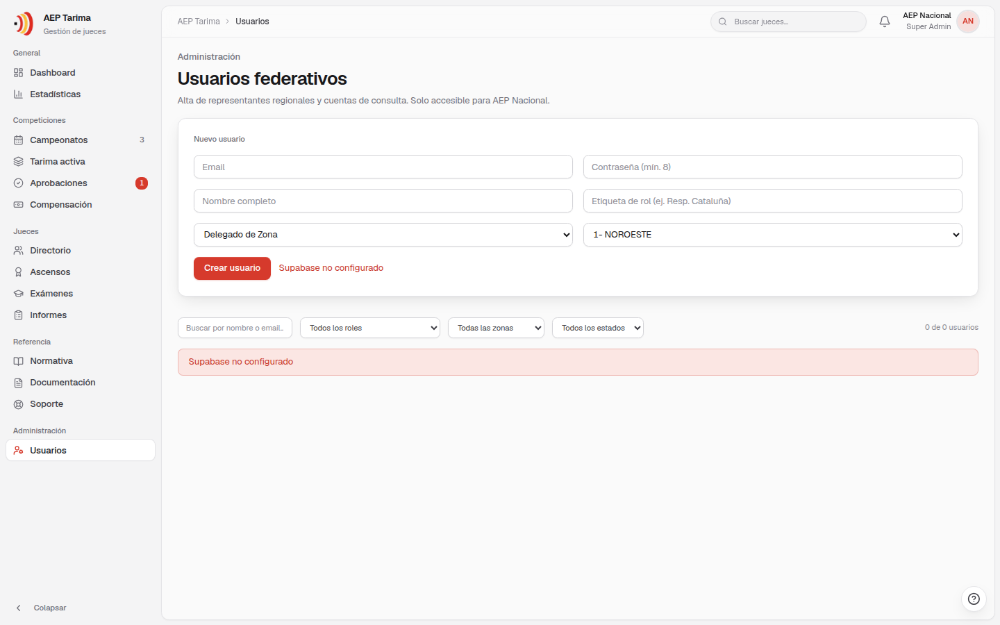

Por cada usuario, la columna **Acciones** ofrece: activar/desactivar, editar (rol/zona), **resetear contraseña** (icono llave) y eliminar.

### Cambiar tu propia contraseña

Cualquier usuario puede cambiarla desde el **menú de usuario en la esquina superior** → **Cambiar contraseña**. Pide la contraseña actual y la nueva (mín. 8 caracteres).

En ese mismo menú, **Tema** permite elegir entre **Sistema** (sigue al ordenador o al móvil), **Claro** y **Oscuro**. La elección se recuerda en ese navegador.

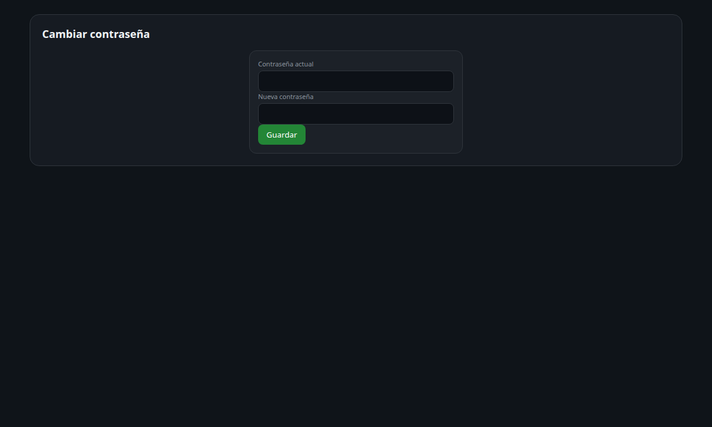

### Resetear la de otro usuario (admin)

Desde Usuarios → icono llave de la fila → escribe la nueva contraseña. No necesitas conocer la actual. Solo un `super_admin` puede resetear a otro `super_admin`.

---

## 10. Normativa

`Normativa` en el menú lateral. Cuatro pestañas:

1. **Guía AEP 2026** — documento de referencia de la temporada.
2. **Plazas en tarima** — requisitos de nivel por tipo de campeonato y rol.
3. **Compensación de jueces** — baremo, km, alojamiento, montaje sistema, recibos.
4. **Reglamento IPF** — artículos buscables con enlaces directos.

---

## 11. Centro de ayuda

Icono **?** en la esquina inferior derecha:

- **Buscador**: escribe lo que necesites (tarima, compensación, ascensos, permisos…) y verás los temas que encajan, con enlaces directos a cada sección.
- **Primeros pasos**: sin buscar nada, muestra la ruta recomendada para tu rol.
- **Temas frecuentes**: accesos rápidos a las dudas más habituales.

Todo funciona en local, sin conexión externa ni IA. Documentación completa: `/docs`.

---

## 12. Aprobaciones, ascensos, exámenes, informes

- **Aprobaciones**: las propuestas de tarima enviadas esperan revisión nacional aquí. Rechazar exige escribir el motivo, que le llega a quien propuso.
- **Ascensos**: solicitud y revisión de cambios de categoría de juez (solo a un nivel superior al actual). Rechazar también exige motivo.
- **Exámenes**: nuevo juez, ascenso a categoría IPF, recertificación.
- **Informes**: por juez o por competición; el delegado de zona ve solo los de su zona, nacional ve todo.

- **Soporte** (`/tickets`): cualquier usuario abre un ticket (incidencia, mejora o duda) con descripción y hasta 5 fotos. Los administradores lo trabajan en un hilo de comentarios, lo marcan en progreso y lo resuelven con una nota; tú ves siempre el estado de los tuyos y puedes cerrarlos.

---

## 13. Roles y permisos

| Rol | Alcance |
|---|---|
| `super_admin` | Control total |
| `delegado_jueces` | Autoridad nacional sobre jueces, exámenes, informes, ascensos |
| `delegado_zona` | Campeonatos, tarimas y jueces de **su zona** |
| `responsable_financiero_jueces` | Panel `/compensation`, compensación y recibos PDF (lectura tarimas/censo) |
| `solo_ver` | Solo lectura |
| `juez` | Solo su portal (`/portal`): su ficha, sus designaciones y las convocatorias |

La UI oculta las acciones fuera de tu alcance, pero el servidor es la fuente de verdad (un delegado de zona no puede tocar datos de otra zona aunque manipule la petición).

---

## 14. Errores frecuentes

- **El PDF de cuadrante no detecta a nadie**: probablemente es un PDF escaneado (imagen). Vuelve a exportarlo con texto seleccionable, o asigna a mano.
- **No aparecen sugerencias de domicilio**: escribe al menos 3 caracteres; incluye población si hace falta. Si sigue vacío, guarda la ficha y el servidor geocodificará al guardar.
- **Campeonato pasado**: queda en solo lectura; la API mutadora devuelve `423`.
- **Excel grande al importar jueces**: divide el archivo o elimina hojas no usadas (límite 8 MB).
- **No veo «Usuarios»**: solo visible para AEP Nacional (`super_admin` / `delegado_jueces`).
- **Tarima aprobada sin editar**: usa «Registrar imprevisto» en la cabecera.
- **No encuentro a un juez al montar la tarima**: revisa en su ficha que esté **Activo** y **Disponible**; los demás no se listan (el pie del panel dice cuántos se ocultan). Si hay disponibilidad confirmada para el campeonato, al elegir un hueco solo salen los confirmados.
- **«Enviar a aprobación» está gris**: falta la plantilla o no hay ningún juez asignado; pasa el ratón por encima para ver el motivo.
- **No puedo cambiar los km o el importe de una liquidación**: está **pagada**; solo admite cambios de estado y notas.

---

**Producción:** [https://aep-tarima.vercel.app](https://aep-tarima.vercel.app) · v2.4
