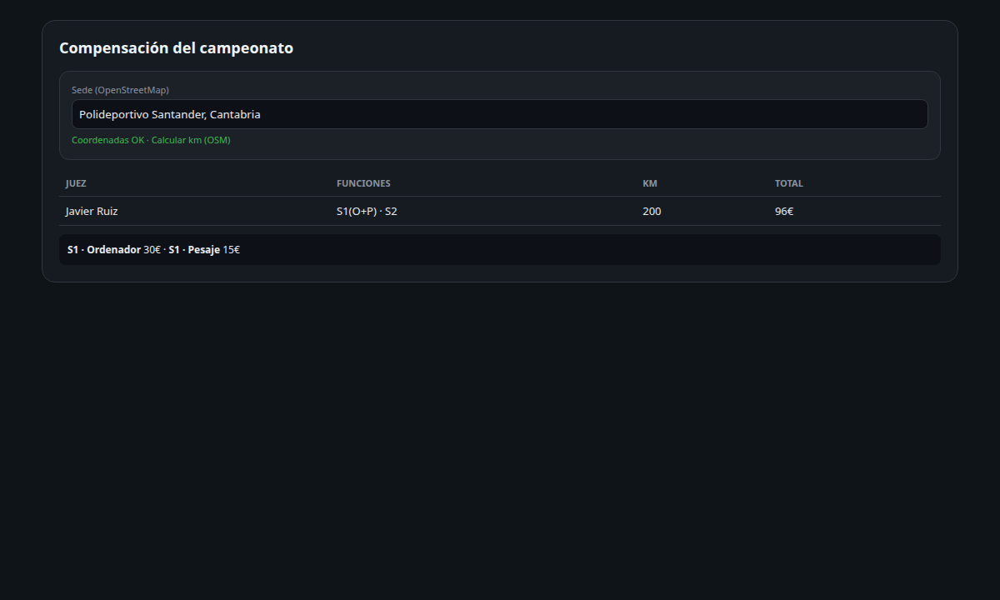

# Compensación de gastos de jueces (AEP)

Fuente normativa: [Criterios Compensación Gastos Jueces (31/10/2025)](https://powerliftingspain.es/wp-content/uploads/2025/10/20251031_Criterios-Compensacion-Gastos-Jueces.pdf).

## Responsable

La compensación económica la gestiona el rol **`responsable_financiero_jueces`** (Responsable Financiero Jueces), **no** el delegado de zona ni el delegado de jueces. El `super_admin` puede intervenir como respaldo administrativo.

## Objetivo

Calcular y gestionar la compensación económica por campeonato de cada juez asignado en tarima: funciones (sesión/pesaje), desplazamiento (km o alternativas aprobadas), alojamiento y responsable de competición. Generar el **recibo PDF** por juez para devolución al organizador.

## Baremo vigente (código: `src/lib/judge-compensation/rates.ts`)

| Concepto | AEP-3 | AEP-2 | AEP-1 | EPF/IPF |
|---|---:|---:|---:|---:|
| Pesaje | 15 € | 15 € | 20 € | 20 € |
| Sesión (tarima) | 30 € | 30 € | 40 € | 40 € |
| Km ida+vuelta | 0,13 €/km | | | |
| Alojamiento / día | 25 € | | | |
| Responsable competición | 20 € / campeonato | 20 € | 20 €* | 0 € |

\* AEP-1 responsable: puede ser 20 €/día o dos responsables — decisión del Presidente del Comité (override manual).

### Reglas de negocio

1. **Funciones**: se cuentan **sesiones distintas** (`S1`, `S2`…) en las que el juez tiene rol de **ordenador** (tarima) o **pesaje**. El desglose UI/PDF agrupa por **Sx** (ordenador + pesaje bajo la misma sesión).
2. **Desplazamiento**: solo si el juez viaja **exclusivamente como juez**. Un vehículo compartido → **un solo** desplazamiento pagado (`shared_vehicle_passenger` en pasajeros).
3. **Km**: **OpenStreetMap** (100 % gratuito) — Photon autocomplete en cliente; Nominatim (geocoding) + OSRM (rutas) en servidor; ida × 2 (enteros). Override manual permitido. Comparte vehículo → 0 km.
4. **Alojamiento**: ida+vuelta **> 150 km** y **≥ 2 funciones**. 25 € × días de campeonato.
5. **Internacional EPF/IPF**: hotel oficial fuera de este cálculo; `ambito: epf|ipf` en competición.

## Recibo PDF (export por juez)

Plantilla alineada con los recibos reales AEP/club. Dos cabeceras:

| Tipo | Cabecera | Devolución |
|---|---|---|
| **Club** | Nombre del club + línea AEP | `compensationClubEmail` del campeonato |
| **AEP** | Membrete AEP nacional | JuecesAEP / TesoreroAEP / PresidenteAEP |

Campos del campeonato (`compensationOrganizer`, `compensationClubName`, `compensationClubEmail`, `compensationVolunteer`) configuran el texto del recibo.

### IBAN — no se almacena

El **número de cuenta (IBAN) no existe en la base de datos ni en perfiles de juez**. Solo se solicita al pulsar **Exportar recibo**; viaja en la petición HTTP, se inserta en el PDF generado y **no se persiste ni se registra** en logs.

```
POST /api/v1/competitions/:id/compensation/:refereeId/export
Body: { "iban": "ES28 0182 …" }   ← efímero
→ application/pdf
```

Código: `src/lib/judge-compensation/receipt-document.ts`, `receipt-pdf.ts`, `iban.ts`.

## Modelo de datos (migration `024`)

| Tabla / columna | Uso |
|---|---|
| `referees.domicilio`, `domicilio_lat`, `domicilio_lng` | Origen desplazamiento |
| `competitions.sede_direccion`, `sede_lat`, `sede_lng`, `ambito` | Destino; baremo |
| `competitions.compensation_*` (migrations `025`, `026`) | Metadatos del recibo; varios clubes (`compensation_clubs`) |
| `judge_compensation_claims` | Una fila por juez × campeonato |
| `judge_compensation_duty_lines` | Desglose sesión/pesaje |

Estados del claim: `borrador` → `enviado` → `aprobado` → `pagado` / `rechazado`.

## Arquitectura

```
Roster assignments + template
        ↓
classifyDuties()  →  duty lines
        ↓
OSRM / Nominatim (OpenStreetMap, gratuito)  →  km ida
        ↓
calculateClaim()  →  importes
        ↓
judge_compensation_claims (persistido, sin IBAN)
        ↓
Export PDF + IBAN introducido al vuelo
```

## API

| Método | Ruta | Permiso |
|---|---|---|
| `GET` | `/compensation/hub` | `canManageCompensation` — panel central |
| `GET` | `/competitions/:id/compensation` | `canManageCompensation` |
| `POST` | `/competitions/:id/compensation/recalculate` | `canManageCompensation` |
| `PATCH` | `/competitions/:id/compensation/:refereeId` | `canManageCompensation` |
| `POST` | `/competitions/:id/compensation/distances` | `canManageCompensation` — km masivo OSM |
| `POST` | `/competitions/:id/compensation/:refereeId/export` | `canManageCompensation` — body `{ iban }` |

## Variables de entorno (opcional)

| Variable | Uso |
|---|---|
| `OSM_USER_AGENT` | Identificación de la app para Nominatim (recomendado en producción) |
| `NOMINATIM_URL` | URL del servicio Nominatim (por defecto nominatim.openstreetmap.org) |
| `OSRM_URL` | URL del router OSRM (por defecto router.project-osrm.org) |

No se requiere ninguna API key de pago.



## UI

- **Panel central** `/compensation` — lista todos los campeonatos con jueces, estado de km y enlace directo a cada compensación (acceso desde la barra lateral).
- Página `/competitions/[id]/compensation` (solo responsable financiero / super_admin).
- **Photon (OpenStreetMap)** autocomplete para la sede; domicilio del juez con el mismo componente en ficha.
- Desglose por **Sx**: cada sesión muestra Ordenador y Pesaje; columna funciones tipo `S1(O+P) · S2`.
- Varios clubes organizadores y e-mails múltiples (listado oficial AEP abril 2026).
- Km enteros; totales bloqueados hasta completar todos los desplazamientos.
- Exportar recibo → modal con desglose → PDF (IBAN efímero).

Ver captura: `docs/images/10-compensacion.png`.

## Tests

- `tests/judge-compensation.test.ts` — baremo y totales.
- `tests/judge-compensation-receipt.test.ts` — texto del recibo e IBAN efímero.
- `tests/judge-compensation-breakdown.test.ts` — desglose por Sx.
